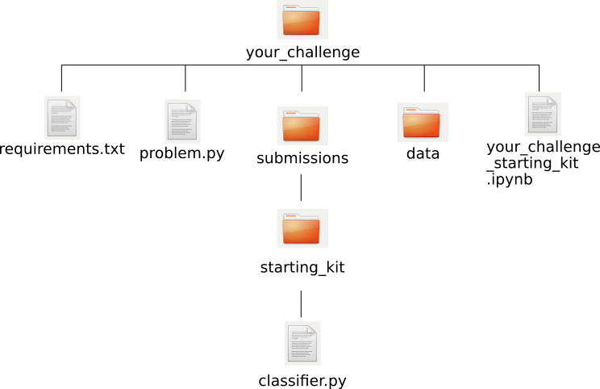

####################
Create New Challenge
####################

Before you start creating your RAMP challenge, make sure that you have the
data needed to run your challenge. RAMP kit will need to include two types of
datasets:

*  public dataset which is given to all of the competing users. This dataset
   will be split for cross-validation (train and test) and can be used for
   self-evaluation during the duration of the challenge;
*  private dataset which is never given to the competing users and which is
   used to evaluate the score of the users after the challenge deadline has
   passed.

To write you own challenge for RAMP you need to create directory with the name
of your challenge in the ramp-kits directory of your RAMP::

        ramp_deployment/ramp_kits/your_challenge

This directory tree should be of the following structure:

With:

*  requirements.txt file
*  problem.py file
*  submissions directory with example submission(s)
*  directory with the public data, and
*  Jupiter notebook introduction the challenge

requirements.txt file
----------------------
This file should include all the libraries required to run your challenge
Its content might, for example, look as follows::

    numpy
    scikit-learn
    pandas
    matplotlib
    seaborn

problem.py Python file
----------------------
Here, you will need to define:

*  what type of problem the user will face during the challenge
   (e.g. classification `pollenating insects problem
   <https://github.com/ramp-kits/pollenating_insects_3_simplified/blob/master/problem.py>`_
   or regression `boston housing problem
   <https://github.com/ramp-kits/boston_housing/blob/master/problem.py>`_);
*  which RAMP workflow you want to use;
*  the score which will be used for evaluation
   and include three functions: `get_cv()`, `get_train_data()`, and
   `get_test_data()`.

The basic Iris `problem.py
<https://github.com/ramp-kits/iris/blob/master/problem.py>`_ (which is a
classification problem) looks like that:

First you need to import all the required libraries::

    import os
    import pandas as pd
    import rampwf as rw
    from sklearn.model_selection import StratifiedShuffleSplit

Next, define the name of the problem::

    problem_title = 'Iris classification'

Define which column in your .csv file is to be classified::

    _target_column_name = 'species'

Specify possible labels::

    _prediction_label_names = ['setosa', 'versicolor', 'virginica']

Choose which prediction class will be used. You can choose from `existing
prediction classes
<https://github.com/paris-saclay-cds/ramp-workflow/tree/master/rampwf/prediction_types>`_
or create your own::

    # A type (class) which will be used to create wrapper objects for y_pred
    Predictions = rw.prediction_types.make_multiclass(
        label_names=_prediction_label_names)

Specify which RAMP workflow will be used. You can use one of the `existing
workflows
<https://github.com/paris-saclay-cds/ramp-workflow/tree/master/rampwf/workflows>`_
or you can create your own::

    # An object implementing the workflow
    workflow = rw.workflows.Classifier()

Next, define which score types will be calculated. Score types defined in
RAMP can be found `here
<https://github.com/paris-saclay-cds/ramp-workflow/tree/master/rampwf/score_types>`_
but if none of those matches your needs, you can also add new one(s)::

    score_types = [
        rw.score_types.Accuracy(name='acc'),
        rw.score_types.ClassificationError(name='error'),
        rw.score_types.NegativeLogLikelihood(name='nll'),
        rw.score_types.F1Above(name='f1_70', threshold=0.7),
    ]

Finally you should create few functions which should include:

* `get_cv()`
  with input X (the training data) and y (test data). This function
  should define how the public dataset is to be split for cross-validation::

    def get_cv(X, y):
        cv = StratifiedShuffleSplit(n_splits=2, test_size=0.2, random_state=57)
        return cv.split(X, y)

* `get_train_data()` and `get_test_data()` should return the correct sets of
  the data::

    def get_train_data(path='.'):
        f_name = 'train.csv'
        return _read_data(path, f_name)

    def get_test_data(path='.'):
        f_name = 'test.csv'
        return _read_data(path, f_name)

    def _read_data(path, f_name):
        data = pd.read_csv(os.path.join(path, 'data', f_name))
        y_array = data[_target_column_name].values
        X_array = data.drop([_target_column_name], axis=1).values
        return X_array, y_array

submission directory
--------------------

All the submissions will be expected to be stored in the submission directory.
The user might select any name for their submission. At least one sample
submission is always given to the users. In the `Iris
<https://github.com/ramp-kits/iris>`_ example three submissions are provided:
error, random_forest_10_10 and starting_kit.

example submission directory and its content
......................................

In Iris example, each of the submission directories include python file called
classifier.py letting the user know that their submission should also include
classifier.py file. The name of the file expected for the submission and its
structure will depend on the workflow you chose to use.

For example, Iris uses workflow `Classifier()` (defined in problem.py) and
therefore the file in the submission has to be classifier.py. Sample of this
file is given to the users as part of Iris challenge. It includes the sample
functions which classifier.py submitted by the user will also need to include,
in Iris example in the starting_kit it looks like this::

    from sklearn.base import BaseEstimator
    from sklearn.ensemble import RandomForestClassifier

    class Classifier(BaseEstimator):
        def __init__(self):
            pass

        def fit(self, X, y):
            self.clf = RandomForestClassifier(
                n_estimators=1, max_leaf_nodes=2, random_state=61)
            self.clf.fit(X, y)

        def predict(self, X):
            return self.clf.predict(X)

        def predict_proba(self, X):
            return self.clf.predict_proba(X)

data directory
--------------

This directory should include all the public datasets (train and test) used in
the challenge.

your_challenge_starting_kit.ipynb Jupiter notebook file
-------------------------------------------------------

Finally, you need to create a notebook informing the users about the challenge.
This notebook will be visible to all logged-in users, no matter if they decided
to take part in the challenge or not. You can structure this file completely
freely as the RAMP will not rely on it during the challenge. However, for the
sake of the users it is recommended that you introduce the problem and explain
what are the requirements. It is also advisable to get the users started by
showing them how to access the data and samples of the code.

examplar RAMP kits
-----------------

For other examples of code of existing challenges feel free to visit RAMP kits
github account: `https://github.com/ramp-kits/
<https://github.com/ramp-kits/>`_.