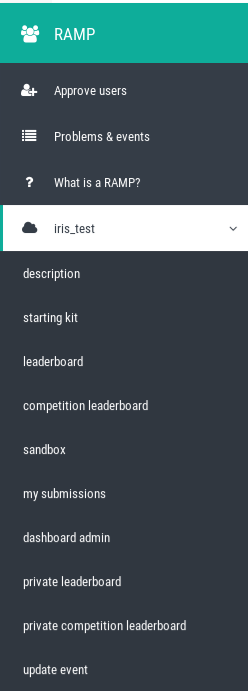

##################################
Interactions with the RAMP website
##################################

Interactions as an administrator
--------------------------------

Approve users' access
.....................

As an administrator, you will be able to authorize user to access the RAMP
website and to participate to private event. Once logged in, you will find on
the left-hand side panel, an "Approve users" menu.

.. image:: _static/img/approve_users_menu.png

Once you clicked on the menu, you will be able to approve several users to
access the RAMP website or a particular RAMP event.

Event menu
..........

When you are an administrator, you will have access to additional information
regarding the event:

* "dashboard admin": the admin dashboard will give you a big picture regarding
  the submissions done by the participants (new, failed, or scored);
* "private leaderboard": the private leaderboard will contain all information
  about all the submissions of all users. It will display all the different
  scores used for the event, on the public data (via cross-validation) and on
  the private data;
* "private competition leaderboard": the private competition leaderboard is
  similar to the private leaderboard. However, it contains only a single
  submission per user, graded on the official score used for the challenge. The
  score is only computed on the private set and should be used as a final
  challenge classification;
* "update event": you can change some settings linked with an event (e.g. time
  between two submissions, name of events, etc.).

Interactions as a user
----------------------

In order to be able to use RAMP you need to be logged in. After signing-up 
you can directly log-in using your newly created username and password, however 
you will not be able to sign up for any RAMP event until your account is 
approved by an administrator.

On the left-hand side you can find a panel with two options: 
'Problems & events' and 'What is a RAMP?'. 

.. image:: _static/img/user_menu.png

Problems & events
.................

By clicking this menu you will be redirected to the list of all the events. 
You can click on the name of the event and view additional information related 
to the event.

.. image:: _static/img/list_of_challenges.png

You can select a challenge to which you would like to sign-up by clicking on one 
of the challenges listed below the name of the event you wish to participate in.

If you see message saying that you 'Your account has not been approved yet 
by the administrator' 

.. image:: _static/img/message.png

it means that you still have to wait until your account is approved before 
signing-up to any challenge.

Otherwise you will be able to see the page with the event information on which 
you will see 'Sign up' button.
 
 .. image:: _static/img/sign_up.png

 Your request will be send to the administrator for further approval. 

Challenge menu
..............

 Once your profile is approved for the challenge, in the RAMP left-hand side 
 menu you will be able find new options:

 .. image:: _static/img/new_menu.png

Now, you can easily view: 

*  "description": information on the challenge;
*  "starting kit": code related to the challenge on github;
*  "leaderboard": will contain the different scores used for the particular 
event. All reported scores are limited to the public dataset only;
*  "competition leaderboard": is similar to the leaderboard. However, only 
the official score is reported for a single submission which is selected by each
 user. This score is computed on the public dataset only and can differ from the
  final ranking which is done on the private set;
*  "sandbox": where you can upload your sumissions. To do that you will have to 
either edit and save existing sample code or upload the files in the column on 
the right-hand side;
*  "my_submissions": you can view all your submissions for this challenge.